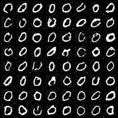

<a id="readme-top"></a>
<!-- PROJECT SHIELDS -->

<!-- PROJECT LOGO -->
<br />
<div align="center">
  <a href="https://github.com/Yavuzhan-Baykara/Stable-Diffusion">
    
  </a>

  <h3 align="center">Diffusion Model Sampler</h3>

  <p align="center">
    An implementation of a diffusion model sampler using a UNet transformer to generate handwritten digit samples.
    <br />
    <a href="https://github.com/Yavuzhan-Baykara/Stable-Diffusion"><strong>Explore the docs »</strong></a>
    <br />
    <br />
    <a href="https://github.com/Yavuzhan-Baykara/Stable-Diffusion">View Demo</a>
    ·
    <a href="https://github.com/Yavuzhan-Baykara/Stable-Diffusion/issues/new?labels=bug&template=bug-report---.md">Report Bug</a>
    ·
    <a href="https://github.com/Yavuzhan-Baykara/Stable-Diffusion/issues/new?labels=enhancement&template=feature-request---.md">Request Feature</a>
  </p>
</div>

<!-- TABLE OF CONTENTS -->
<details>
  <summary>Table of Contents</summary>
  <ol>
    <li>
      <a href="#about-the-project">About The Project</a>
      <ul>
        <li><a href="#built-with">Built With</a></li>
      </ul>
    </li>
    <li>
      <a href="#getting-started">Getting Started</a>
      <ul>
        <li><a href="#prerequisites">Prerequisites</a></li>
        <li><a href="#installation">Installation</a></li>
      </ul>
    </li>
    <li><a href="#usage">Usage</a></li>
    <li><a href="#results">Results</a></li>
    <li><a href="#roadmap">Roadmap</a></li>
    <li><a href="#contributing">Contributing</a></li>
    <li><a href="#license">License</a></li>
    <li><a href="#contact">Contact</a></li>
    <li><a href="#acknowledgments">Acknowledgments</a></li>
  </ol>
</details>

<!-- ABOUT THE PROJECT -->
## About The Project

Diffusion models have shown great promise in generating high-quality samples in various domains. In this project, we utilize a UNet transformer-based diffusion model to generate samples of handwritten digits. The process involves:
1. Setting up the model and loading pre-trained weights.
2. Generating samples for each digit.
3. Creating a GIF to visualize the generated samples.

<div align="center">
  
</div>

<p align="right">(<a href="#readme-top">back to top</a>)</p>

### Built With

#### AI and Machine Learning Libraries

<div align="center">
  
  
  
  
  
</div>

<p align="right">(<a href="#readme-top">back to top</a>)</p>

<!-- GETTING STARTED -->
## Getting Started

To get a local copy up and running follow these simple example steps.

### Prerequisites

Ensure you have the following prerequisites installed:
* Python 3.8 or higher
* CUDA-enabled GPU (optional but recommended)
* The following Python libraries:
  - torch
  - torchvision
  - numpy
  - Pillow
  - matplotlib

### Installation

1. Clone the repository:
    ```sh
    git clone https://github.com/Yavuzhan-Baykara/Stable-Diffusion.git
    cd Stable-Diffusion
    ```
2. Install the required Python libraries:
    ```sh
    pip install torch torchvision numpy Pillow matplotlib
    ```

<p align="right">(<a href="#readme-top">back to top</a>)</p>

<!-- USAGE -->
## Usage

To train the UNet transformer with different datasets and samplers, use the following command:
```sh
python train.py <dataset> <sampler> <epoch> <batch_size>
